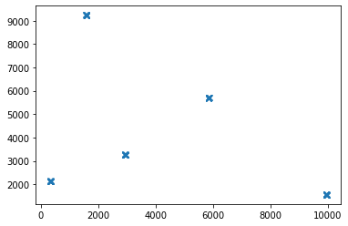
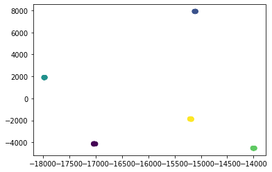
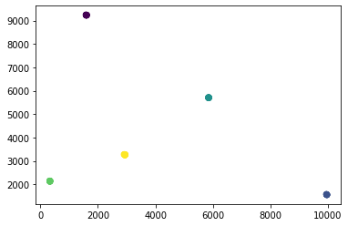
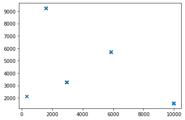
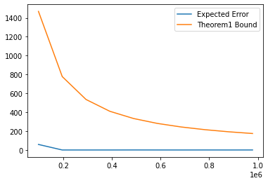
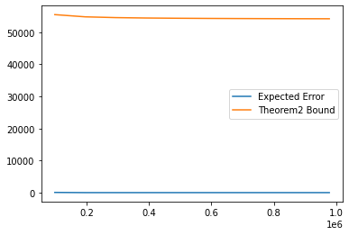
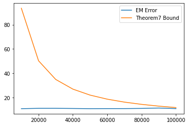

# Big Data Project
## Implementation of "Learning Mixture of Gaussians with Streaming Data"
It is final project of Big Data Analysis course and the paper implemented by me, [Ali Mortazavi](https://github.com/AliMorty) and Bita Jalali.


## 1. Abstract
In this project, we explore a theoretical paper published in Neurips2017 Conference titled **Learning Mixture of Gaussians with Streaming Data** by doing some experimental tests on the performance of the algorithm.  You can find the original paper [here](https://papers.nips.cc/paper/7238-learning-mixture-of-gaussians-with-streaming-data).<br>
The authors of the paper proposed an algorithm with a theoretical guarantee for the problem of **clustering the streaming data points where data points come from a Mixture of Gaussian Distribution**. In particular, they showed that with high probability, the algorithm eventually finds (/learns) the mixture of Gaussians accurately. Moreover, they showed that the learning rate is near-optimal. Meaning that in each step, the error decreases optimally. Note that, as the problem of learning the mixture of Gaussian is NP-Hard, they used a simplification assumption for the data to make the problem tractable. The simplification assumption they used is that data comes from a mixture of **well-separated** Gaussians. (i.e. the centers of any two clusters are far enough so that the algorithm can decide computationally easily whether the point belongs to the first cluster or the second one.)<br> Although the assumption allows them to have a good performance for this problem, one question might arise:
Is the analysis of the paper tight? 
<br> 
One way to find an answer to this question is to test the algorithm's performance by running some experimental tests. Of course, the experimental tests just provide evidence and they are not proof. <br>


## 2. Project Outline
In the following, we will first give a bit explanation about the general setup and data distribution in the first section. Then we explain the theorems about the performance of the algorithm. Finally, we test the algorithm performance by generating data from the mixture of Gaussian Distribution and run our implementation of the paper's algorithm <br>

## 3. Setup 
### 3.1. Data Distribution

Data is drawn from a mixture of a mixture of k spherical Gaussians distributions, <br>
i.e. for all $i = 1,2,...,k$:
$$ x^t {\sim} \sum_{i} w_i \mathcal{N}(\mu_i^*, \sigma^2 I) , \sigma_i^* \in \mathcal{R}^d  $$ 

where $\mu_i^*$ is the mean of the i-th mixture component (i-th cluster), mixture weights $w_i \geq 0$, and
$\sum_i wi = 1$. <br>
For simplicity, we assumed all $\sigma_i=\sigma$ are the same. But the algorithm doesn't require this assumption. 

### 3.2. Seperation Assumption
As we stated earlier, the paper used a simplification assumption for the data. In particular, any two centers $i , j$ should be far away from each other at least $C \sigma $ i.e.:
$$ ||\mu_i^* - \mu_j^*|| \geq C \sigma $$

We will explain more about the constant C in the next sections.


## 4. Algorithm Overview
The algorithm consists of two parts: Algorithm1 (initialization algorithm), Algorithm2 (Streaming Lloyd's Algorithm)<br>
### 4.1 Initialization 
In the initialization part, we try to find k initial centers for k clusters. To do so, we first use SVD-style operations to project d dimensional data points into a k-dimensional space. This project will de-noise the data, making it easy for the algorithm to identify all k distinct clusters. After we find k clusters in the projected space, we project centers for each cluster to the original d-dimensional space. This way, we have a good initialization for the k centers.


```python
import numpy as np
import matplotlib.pyplot as plt
from scipy.stats import ortho_group
from scipy import linalg
import random
from sklearn import neighbors
import sklearn.metrics.pairwise
from scipy.sparse import csgraph
import random
import pandas as pd
# Defining Fixed Parameters
d = 10
k = 5
scaler = 10000
sigma = 100
num_of_samples = int(d*d*d*k*k*k*np.log(d*k))  #N0
w = np.ones(k) / k

## For initializatoin, we need C to be at least OMEGA((klogk)^1/4). So:
C = 10*((k*np.log(k))**(1/4))
C2 = (np.log(k)**(1/2))
##TODO: Change max to min but make sure that you ignore the diagonal values as they are zeros and they should be ignored. 
def generate_distant_means(dimension, C, std):

    mu = np.random.rand(d, k) * scaler
    dist = sklearn.metrics.pairwise.euclidean_distances(mu.T)
    max_dist = np.max(dist)
    while (max_dist < C):
        print ("close_initial_points_occured, start again")
        mu = np.random.rand(d, k) * scaler
        dist = sklearn.metrics.pairwise.euclidean_distances(mu.T)
        max_dist = np.max(dist)
    return mu

mu = generate_distant_means(d, C, sigma)
print ("True Centers for Clusters")

tmp = pd.DataFrame(mu)
tmp
```

    True Centers for Clusters


<div>
<style scoped>
    .dataframe tbody tr th:only-of-type {
        vertical-align: middle;
    }

    .dataframe tbody tr th {
        vertical-align: top;
    }

    .dataframe thead th {
        text-align: right;
    }
</style>
<table border="1" class="dataframe">
  <thead>
    <tr style="text-align: right;">
      <th></th>
      <th>0</th>
      <th>1</th>
      <th>2</th>
      <th>3</th>
      <th>4</th>
    </tr>
  </thead>
  <tbody>
    <tr>
      <th>0</th>
      <td>330.866695</td>
      <td>1592.683836</td>
      <td>2944.320020</td>
      <td>9962.937967</td>
      <td>5853.346165</td>
    </tr>
    <tr>
      <th>1</th>
      <td>2132.275717</td>
      <td>9237.097793</td>
      <td>3265.570185</td>
      <td>1562.701494</td>
      <td>5699.554717</td>
    </tr>
    <tr>
      <th>2</th>
      <td>6060.283353</td>
      <td>5569.666050</td>
      <td>409.092062</td>
      <td>2363.665258</td>
      <td>2617.110061</td>
    </tr>
    <tr>
      <th>3</th>
      <td>6114.819306</td>
      <td>1627.059121</td>
      <td>3403.442057</td>
      <td>6817.543043</td>
      <td>3382.809773</td>
    </tr>
    <tr>
      <th>4</th>
      <td>3936.485869</td>
      <td>5456.217746</td>
      <td>2443.242682</td>
      <td>5012.802796</td>
      <td>9621.939483</td>
    </tr>
    <tr>
      <th>5</th>
      <td>6075.204441</td>
      <td>3299.465330</td>
      <td>8988.023537</td>
      <td>2053.151819</td>
      <td>8979.809488</td>
    </tr>
    <tr>
      <th>6</th>
      <td>4076.944947</td>
      <td>9141.843753</td>
      <td>5706.804996</td>
      <td>7593.784282</td>
      <td>6401.821169</td>
    </tr>
    <tr>
      <th>7</th>
      <td>3538.960768</td>
      <td>4945.260117</td>
      <td>5823.908468</td>
      <td>4446.951617</td>
      <td>3231.770582</td>
    </tr>
    <tr>
      <th>8</th>
      <td>8690.938024</td>
      <td>7077.071907</td>
      <td>7232.449403</td>
      <td>3030.412195</td>
      <td>2919.475121</td>
    </tr>
    <tr>
      <th>9</th>
      <td>2672.001358</td>
      <td>4766.881424</td>
      <td>5883.643620</td>
      <td>4931.263377</td>
      <td>8034.932406</td>
    </tr>
  </tbody>
</table>
</div>


```python
class SampleGenerator:
    def __init__(self, weights, mu, sigma, d):
        self.weights = weights
        self.mu = mu
        self.sigma=sigma
        self.d = d
    
    def draw_a_sample(self):
        rand = random.uniform(0,1)
        for i in range(len(self.weights)):
            rand -= self.weights[i]
            if (rand <=0):
                return np.random.multivariate_normal(self.mu[:,i], self.sigma * np.identity(self.d), 1).T
    
    def generate_samples(self, sample_size):
        samples = []
        for i in range(sample_size):
            if len(samples) == 0:
                samples = self.draw_a_sample()
            else:
                samples = np.append(samples, self.draw_a_sample(), axis=1)
        return samples

generator = SampleGenerator(w, mu, sigma, d)
```

### Finding k-dimensional subspace using Streaming PCA method
In this part, we are going to find a k dimensional space to reduce the noise of each cluster. This way, all points from a single clusters will become closer to each other, allowing us to use Nearest Neighbor Graph to identify each cluster easily. 


```python
N0 = num_of_samples

S = np.zeros((d, d))
k_2 = int (10*k*np.log(k))

B = int(d * np.log(d))
# In this part we use QR algorithm to find k Eigenvectors for each cluster
U = ortho_group.rvs(dim=d)[:, :k]  # Choosing k orthonormal vectors in Rd space
for t in range(N0 - k_2):
    if t % B == B-1:
        Q, R = linalg.qr(np.matmul(S, U))
        U = Q
        S = np.zeros((d, d))
    reshaped_sample = generator.draw_a_sample().reshape(-1, 1)
    S = S + np.matmul(reshaped_sample, reshaped_sample.T)
```

### Sample Generator


```python
def generate_samples(sample_size):
    #TODO: The append part takes O(n) time which is not optimum. We should change it in the future.
    samples = []
    for i in range(sample_size):
        if len(samples) == 0:
            samples = generator.draw_a_sample()
        else:
            samples = np.append(samples, generator.draw_a_sample(), axis=1)
    return samples
```

### Space Overview
100 points drawn from the distribution are depicted here. (note that we have shown a 2-d subspace from the original d-dimensional space of data points. <br>
You can see there are k clusters.


```python
temp = generate_samples(100)
plt.plot(temp[0, :], temp[1,:], 'x')
plt.show()
```





### Using Nearest Neighbor to find all k clusters
First, we project points to the k-dimensional space to reduce the noise, then using each point as a node, we build a nearest neighbor graph. Each connected component in the graph would represent a cluster. 


```python
X0 = generate_samples(k_2)
save_U = U
U = U[:, 0:k]
components = np.matmul(U.T, X0)
adj = neighbors.kneighbors_graph(np.transpose(components), 3)
n_components, labels = csgraph.connected_components(adj)

fig, ax = plt.subplots()
ax.scatter(components[0], components[1], c=labels)
print ("THIS is k-dimentional subspace")
plt.show()

```

    THIS is k-dimentional subspace





```python
components = np.matmul(U, components)
fig, ax = plt.subplots()
ax.scatter(components[0], components[1], c=labels)
print ("This is Original Space!")
plt.show()

print (components.shape)
print (X0.shape)
```

    This is Original Space!




### The original Data


```python
temp = generate_samples(100)
plt.plot(temp[0, :], temp[1,:], 'x')
plt.show()
```





```python
components_mean = np.zeros((k, d))
components_by_labels = []
for c in range(k):
    list_of_indices = np.where(labels == c)[0]
    components_mean[c] = np.mean(components[:, list_of_indices], axis=1)
    
print("Components mean:")
pd.DataFrame(components_mean.T)
```

    Components mean:


<div>
<style scoped>
    .dataframe tbody tr th:only-of-type {
        vertical-align: middle;
    }

    .dataframe tbody tr th {
        vertical-align: top;
    }

    .dataframe thead th {
        text-align: right;
    }
</style>
<table border="1" class="dataframe">
  <thead>
    <tr style="text-align: right;">
      <th></th>
      <th>0</th>
      <th>1</th>
      <th>2</th>
      <th>3</th>
      <th>4</th>
    </tr>
  </thead>
  <tbody>
    <tr>
      <th>0</th>
      <td>1595.711986</td>
      <td>9959.514702</td>
      <td>5853.255765</td>
      <td>329.540575</td>
      <td>2937.549900</td>
    </tr>
    <tr>
      <th>1</th>
      <td>9236.328278</td>
      <td>1557.875046</td>
      <td>5702.571121</td>
      <td>2132.529562</td>
      <td>3261.914944</td>
    </tr>
    <tr>
      <th>2</th>
      <td>5577.287155</td>
      <td>2361.796761</td>
      <td>2614.630451</td>
      <td>6057.967488</td>
      <td>413.756027</td>
    </tr>
    <tr>
      <th>3</th>
      <td>1622.833396</td>
      <td>6816.746048</td>
      <td>3384.201598</td>
      <td>6115.296677</td>
      <td>3405.319851</td>
    </tr>
    <tr>
      <th>4</th>
      <td>5449.638000</td>
      <td>5016.487603</td>
      <td>9610.478273</td>
      <td>3934.831259</td>
      <td>2440.172973</td>
    </tr>
    <tr>
      <th>5</th>
      <td>3301.458048</td>
      <td>2046.191988</td>
      <td>8980.793006</td>
      <td>6071.727241</td>
      <td>8987.282351</td>
    </tr>
    <tr>
      <th>6</th>
      <td>9144.341475</td>
      <td>7594.503771</td>
      <td>6410.580483</td>
      <td>4076.321658</td>
      <td>5712.465819</td>
    </tr>
    <tr>
      <th>7</th>
      <td>4943.611725</td>
      <td>4446.285555</td>
      <td>3222.699492</td>
      <td>3538.793273</td>
      <td>5827.021373</td>
    </tr>
    <tr>
      <th>8</th>
      <td>7075.887503</td>
      <td>3031.410281</td>
      <td>2915.983306</td>
      <td>8689.949603</td>
      <td>7230.836730</td>
    </tr>
    <tr>
      <th>9</th>
      <td>4769.155757</td>
      <td>4928.492969</td>
      <td>8039.437913</td>
      <td>2670.602884</td>
      <td>5891.542394</td>
    </tr>
  </tbody>
</table>
</div>


```python
print ("TRUE centers")
pd.DataFrame(mu)
```

    TRUE centers


<div>
<style scoped>
    .dataframe tbody tr th:only-of-type {
        vertical-align: middle;
    }

    .dataframe tbody tr th {
        vertical-align: top;
    }

    .dataframe thead th {
        text-align: right;
    }
</style>
<table border="1" class="dataframe">
  <thead>
    <tr style="text-align: right;">
      <th></th>
      <th>0</th>
      <th>1</th>
      <th>2</th>
      <th>3</th>
      <th>4</th>
    </tr>
  </thead>
  <tbody>
    <tr>
      <th>0</th>
      <td>330.866695</td>
      <td>1592.683836</td>
      <td>2944.320020</td>
      <td>9962.937967</td>
      <td>5853.346165</td>
    </tr>
    <tr>
      <th>1</th>
      <td>2132.275717</td>
      <td>9237.097793</td>
      <td>3265.570185</td>
      <td>1562.701494</td>
      <td>5699.554717</td>
    </tr>
    <tr>
      <th>2</th>
      <td>6060.283353</td>
      <td>5569.666050</td>
      <td>409.092062</td>
      <td>2363.665258</td>
      <td>2617.110061</td>
    </tr>
    <tr>
      <th>3</th>
      <td>6114.819306</td>
      <td>1627.059121</td>
      <td>3403.442057</td>
      <td>6817.543043</td>
      <td>3382.809773</td>
    </tr>
    <tr>
      <th>4</th>
      <td>3936.485869</td>
      <td>5456.217746</td>
      <td>2443.242682</td>
      <td>5012.802796</td>
      <td>9621.939483</td>
    </tr>
    <tr>
      <th>5</th>
      <td>6075.204441</td>
      <td>3299.465330</td>
      <td>8988.023537</td>
      <td>2053.151819</td>
      <td>8979.809488</td>
    </tr>
    <tr>
      <th>6</th>
      <td>4076.944947</td>
      <td>9141.843753</td>
      <td>5706.804996</td>
      <td>7593.784282</td>
      <td>6401.821169</td>
    </tr>
    <tr>
      <th>7</th>
      <td>3538.960768</td>
      <td>4945.260117</td>
      <td>5823.908468</td>
      <td>4446.951617</td>
      <td>3231.770582</td>
    </tr>
    <tr>
      <th>8</th>
      <td>8690.938024</td>
      <td>7077.071907</td>
      <td>7232.449403</td>
      <td>3030.412195</td>
      <td>2919.475121</td>
    </tr>
    <tr>
      <th>9</th>
      <td>2672.001358</td>
      <td>4766.881424</td>
      <td>5883.643620</td>
      <td>4931.263377</td>
      <td>8034.932406</td>
    </tr>
  </tbody>
</table>
</div>


## Thoerem 3

As you can see, the TRUE MEANS are very close to initial algorithm's output as desired. <br>
As we know in the **Theorem 3** of the paper, 
if each two centers have enough seperations, $\Omega k \log k )^{1/4}$,<br>
then with high probability $1 - \dfrac{1}{poly(k)}$, the distance between TRUE center and algorithm's output can be bounded by<br>
$$|| \mu_i^0 - \mu_i^*|| \leq \dfrac{C}{20}\sigma$$

#### Comparision Between "Alg centers output" and "TRUE centeres"


```python
comparision_matrix = sklearn.metrics.pairwise.euclidean_distances(mu.T, components_mean)
print ("Distance between each cluster center and algorithm's output for that center:")
theorem3_bound= C*sigma/20
tmp = np.ones(k) * theorem3_bound
distance_tmp = np.min(comparision_matrix, axis=0)
DF = pd.DataFrame(np.min(comparision_matrix, axis=0))
DF.columns = ["Distance"]
DF   

distance = np.sum(np.min(comparision_matrix, axis=0))
print(DF)
print(distance)
```

    Distance between each cluster center and algorithm's output for that center:
        Distance
    0  12.185854
    1  10.525660
    2  18.466775
    3   5.058859
    4  14.183543
    60.42069018957645


```python
print ("Theorem 3 Bound: C/20 * sigma")
theorem3_bound
```

    Theorem 3 Bound: C/20 * sigma
    84.21337295817725


### 4.2 Streaming Clustering (using Lloyd Heuristic)

#### ***Let N > O(1)k^3d^3log d***


```python
def distance_calculator(mu, mu_t):
    comparision_matrix = sklearn.metrics.pairwise.euclidean_distances(mu.T, mu_t.T)
    theorem3_bound= C*sigma/20
    tmp = np.ones(k) * theorem3_bound
    distance_tmp = np.min(comparision_matrix, axis=0)
    distance = np.sum(np.min(comparision_matrix, axis=0))
    return distance
```


```python
from numpy import linalg as LA
import copy

mu01=components_mean.T

def streaming_kmeans(n, input_mu, num_of_logs):
    mu0 = copy.deepcopy(input_mu)
    distance_log = []
    eta=3*k*(np.log2(3*n))/n
    cut = int(n / num_of_logs)
    for t in range(n):
        if t % cut == 0:
            d = distance_calculator(mu, mu0)
            distance_log.append(d)
        x=generator.draw_a_sample()

        dis=LA.norm((x-mu0),axis=0)
        i=np.argmin(dis)
        x=x.reshape(-1)
        mu0[:,i]=np.multiply((1-eta),mu0[:,i])+np.multiply(eta,x)
    return mu0, distance_log

print("final mean:")
num_of_logs = 10
n=2*int(d*d*d*k*k*k*np.log(d*k))
```

    final mean:


## Theroem 1


```python
def theorem_1(mu, N, sigma, K, C, d):
    return (np.max(LA.norm(mu,axis=0)) / N) + (K**3 * (sigma**2 * d * np.log(N) / N) + np.exp(-C**2 / 8) * (C**2 + K)* sigma**2)
```


```python
run_count = 2
error_matrix = np.zeros((run_count, num_of_logs))
Ns = []
n = 2*int(d*d*d*k*k*k*np.log(d*k))
for run in range(run_count):
    mu_t, distance_log = streaming_kmeans(n, mu01, num_of_logs)
    error_matrix[run] = distance_log[:num_of_logs]
print(error_matrix)
```

    [[60.42069019  1.87186898  1.8527368   1.94149964  2.03626929  1.96715912
       1.65601972  2.21425012  1.97792386  2.13415165]
     [60.42069019  1.95681541  1.77998779  1.84137732  2.44125269  2.12873823
       2.05096963  1.98234627  1.76737377  2.02814543]]


```python
mean_error = np.mean(error_matrix, axis=0)
mean_error

theorem_1_log = []
Ns = []
for i in range(num_of_logs):
    cut = int(n / num_of_logs)
    theorem_1_log.append(theorem_1(mu, cut * (i+1), sigma, k, C, d))
    Ns.append(cut * (i+1))

    
p1, =plt.plot(Ns, mean_error, label='Expected Error')
p2, =plt.plot(Ns, theorem_1_log, label='Theorem1 Bound')
plt.legend(loc='best')
plt.show()
```





## Theorem 2


```python
theorem_2_log = []
for i in range(num_of_logs):
    cut = int(n / num_of_logs)
    theorem_2_log.append(theorem_1(mu, cut * (i+1), sigma, k, C2, d))
p1, =plt.plot(Ns, mean_error, label='Expected Error')
p2, =plt.plot(Ns, theorem_2_log, label='Theorem2 Bound')
plt.legend(loc='best')
plt.show()
```





### 4.3 Soft version of Streaming Clustering (Expectation Maximization)


```python
eta = 3 * np.log(n) / n

k = 2
sigma = 100
num_of_samples = int(d*d*d*k*k*k*np.log(d*k))  #N0
w = np.ones(k) / k
while True:
    mu = np.random.rand(1, d) * scaler
    if 2 * LA.norm(mu) / sigma > 4:
        break
mu1 = mu.reshape(-1, 1)
mu = np.concatenate([mu1, -mu1], axis=1)
generator = SampleGenerator(w, mu, sigma, d)
```


```python
N0 = num_of_samples

S = np.zeros((d, d))
k_2 = int (10*k*np.log(k))

B = int(d * np.log(d))
# In this part we use QR algorithm to find k Eigenvectors for each cluster
U = ortho_group.rvs(dim=d)[:, :k]  # Choosing k orthonormal vectors in Rd space
for t in range(N0 - k_2):
    if t % B == B-1:
        Q, R = linalg.qr(np.matmul(S, U))
        U = Q
        S = np.zeros((d, d))
    reshaped_sample = generator.draw_a_sample().reshape(-1, 1)
    S = S + np.matmul(reshaped_sample, reshaped_sample.T)
    
X0 = generator.generate_samples(int(k * np.log(k)) * 100)
save_U = U
U = U[:, 0:k]
components = np.matmul(U.T, X0)
adj = neighbors.kneighbors_graph(np.transpose(components), 3)
n_components, labels = csgraph.connected_components(adj)

components = np.matmul(U, components)

components_mean = np.zeros((k, d))
components_by_labels = []
for c in range(k):
    list_of_indices = np.where(labels == c)[0]
    components_mean[c] = np.mean(components[:, list_of_indices], axis=1)
    
print("Components mean:")
pd.DataFrame(components_mean.T)

```

    Components mean:


<div>
<style scoped>
    .dataframe tbody tr th:only-of-type {
        vertical-align: middle;
    }

    .dataframe tbody tr th {
        vertical-align: top;
    }

    .dataframe thead th {
        text-align: right;
    }
</style>
<table border="1" class="dataframe">
  <thead>
    <tr style="text-align: right;">
      <th></th>
      <th>0</th>
      <th>1</th>
    </tr>
  </thead>
  <tbody>
    <tr>
      <th>0</th>
      <td>-6860.805228</td>
      <td>6860.324109</td>
    </tr>
    <tr>
      <th>1</th>
      <td>-3387.987545</td>
      <td>3387.594833</td>
    </tr>
    <tr>
      <th>2</th>
      <td>-6462.469029</td>
      <td>6462.764062</td>
    </tr>
    <tr>
      <th>3</th>
      <td>-2488.811675</td>
      <td>2487.946125</td>
    </tr>
    <tr>
      <th>4</th>
      <td>-3772.291355</td>
      <td>3771.761091</td>
    </tr>
    <tr>
      <th>5</th>
      <td>-6048.222240</td>
      <td>6047.984681</td>
    </tr>
    <tr>
      <th>6</th>
      <td>-528.199426</td>
      <td>528.165493</td>
    </tr>
    <tr>
      <th>7</th>
      <td>-5057.924539</td>
      <td>5058.506777</td>
    </tr>
    <tr>
      <th>8</th>
      <td>-4220.923949</td>
      <td>4221.431446</td>
    </tr>
    <tr>
      <th>9</th>
      <td>-4198.118630</td>
      <td>4198.349011</td>
    </tr>
  </tbody>
</table>
</div>


```python
comparision_matrix = sklearn.metrics.pairwise.euclidean_distances(mu.T, components_mean)
theorem3_bound= C*sigma/20
tmp = np.ones(k) * theorem3_bound
distance = np.min(comparision_matrix, axis=0)
print(mu)
print(theorem3_bound)
print(distance)
```

    [[ 6862.11319977 -6862.11319977]
     [ 3389.87020904 -3389.87020904]
     [ 6461.58603634 -6461.58603634]
     [ 2487.43770585 -2487.43770585]
     [ 3772.86764979 -3772.86764979]
     [ 6043.92763651 -6043.92763651]
     [  525.5027017   -525.5027017 ]
     [ 5058.9659104  -5058.9659104 ]
     [ 4218.52890698 -4218.52890698]
     [ 4199.66037439 -4199.66037439]]
    84.21337295817725
    [6.57026576 6.71968489]


```python
def em(N):
    meyou = copy.deepcopy(components_mean.T[:, 0].reshape(-1, 1))
    N = 20000
    for t in range(N):
        x = generator.draw_a_sample()
        A = np.exp((-(LA.norm(x - meyou)) ** 2) / sigma ** 2)
        B = np.exp((-(LA.norm(x - meyou)) ** 2) / sigma ** 2) + np.exp((-(LA.norm(x + meyou)) ** 2) / sigma ** 2)
        w = A / B
        meyou = np.multiply((1 - eta), meyou) + np.multiply(eta * (2 * w - 1), x)
    return meyou

```

## Theorem 7


```python
def theorem_7(N, sigma, d):
    return (LA.norm(mu1) / N) + (((np.log(N)) / N) * d * sigma**2)
```


```python
run_count = 10
distance_vector = []
theorem7_vector = []
Ns = []
n = 2*int(d*d*d*k*k*k*np.log(d*k))
for run in range(run_count):
    n = (run + 1) * 10000
    meyou = em(n)
    meyous = np.concatenate([meyou, -meyou], axis=1)
    distance = distance_calculator(-mu.T, meyous.T)
    print(distance)
    distance_vector.append(distance)
    theorem7_vector.append(theorem_7(n, sigma, d))
    Ns.append(n)

    
p1, =plt.plot(Ns, distance_vector, label='EM Error')
p2, =plt.plot(Ns, theorem7_vector, label='Theorem7 Bound')
plt.legend(loc='best')
plt.show()
```



